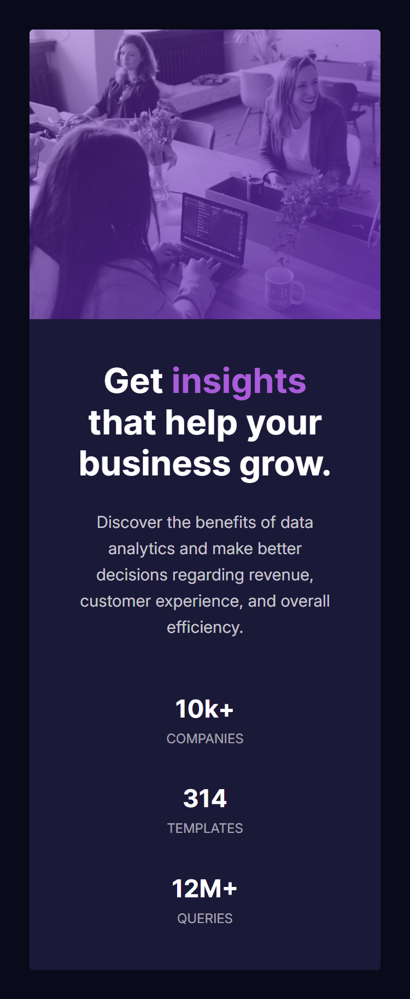

# Frontend Mentor - Stats preview card component solution

This is a solution to the [Stats preview card component challenge on Frontend Mentor](https://www.frontendmentor.io/challenges/stats-preview-card-component-8JqbgoU62). Frontend Mentor challenges help you improve your coding skills by building realistic projects.

## Table of contents

- [The challenge](#the-challenge)
- [Screenshot](#screenshot)
- [Links](#links)
- [Built with](#built-with)
- [What I learned](#what-i-learned)
- [Continued development](#continued-development)
- [Useful resources](#useful-resources)
- [Author](#author)

### The challenge

Users should be able to:

- View the optimal layout depending on their device's screen size

### Screenshot

Large screen

Small screen

### Links

- [Solution URL](https://www.frontendmentor.io/solutions/stats-preview-card-component-Qc-eJe2Ml3)
- [Live Site URL](https://micodit.github.io/stats-preview-card/)

### Built with

- Semantic HTML5 markup
- SASS
- Flexbox

### What I learned

- I learnt how to use SASS, especially `@use` and `@forward` instead of `@import`. I also learnt how to organize SASS code using the 7-1 pattern architechture.

- I learnt that when writing relative path to an image or so in a SCSS file, I should think about where the compiled CSS will live because the URLs in SCSS files are copied into the compiled CSS as-is. So they are interpreted relative to the final CSS file's location. This means, I should plan my folder structure properly.

- I learnt the difference between `background-blend-mode` and `mix-blend-mode` properties.

### Continued development

I want to practice further with SASS, espcially the advanced useage of mixins and functions.

I also want to improve my ability of controlling images in my projects. Currently, sometimes I couldn't control them as expected.

### Useful resources

- [Sass Guidelines](https://sass-guidelin.es/#architecture) - This helped me to understand the 7-1 pattern further.

## Author

- Github - [Micodit](https://github.com/Micodit)
- Frontend Mentor - [Micodit](https://www.frontendmentor.io/profile/Micodit)
